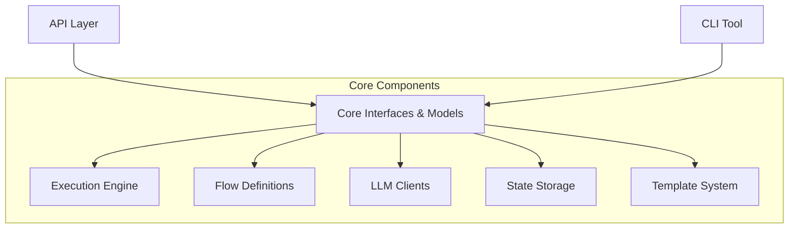

# Pantheon Framework - System Patterns

## System Architecture
The Pantheon Framework follows a modular architecture with clear separation of concerns between components:

## Key Technical Decisions

1. **Interface-Based Design**: The framework is built around interfaces (`IExecutor`, `IFlow`, `IFlowStorage`, `ILlmClient`, `ITemplate`) that define clear contracts for components.

2. **Plug-in Architecture**: Components can be switched out through dependency injection, allowing for different implementations of core services.

3. **Flow-Based Programming Model**: The framework uses a flow-based approach where complex operations are modeled as flows with defined inputs, outputs, and execution paths.

4. **Separation of Execution from Definition**: Flows are defined separately from their execution, allowing for different execution strategies (in-memory, distributed, etc.).

5. **Template System**: Templates provide a standardized way to interact with LLMs, defining prompts and handling responses.

## Design Patterns in Use

1. **Strategy Pattern**: For interchangeable algorithms (e.g., different LLM clients)
2. **Repository Pattern**: For data access abstraction (flow storage)
3. **Factory Pattern**: For creating flow instances
4. **Template Method Pattern**: For defining skeleton algorithms in the template system
5. **Dependency Injection**: For component composition and testability
6. **Observer Pattern**: For monitoring flow execution state changes

## Component Relationships

### Core Interfaces
The `Pantheon.Framework.Core` project defines the fundamental interfaces and models used across the framework:
- `IExecutor`: Responsible for executing flows
- `IFlow`: Defines the contract for a flow definition
- `IFlowStorage`: Interface for persisting flow state
- `ILlmClient`: Contract for LLM integration
- `ITemplate`: Interface for template definitions

### Flow System
Flows are the central concept, representing a series of operations with defined inputs, outputs, and execution logic.

### Template System
Templates provide standardized patterns for LLM interaction, defining prompts, input formatting, and response handling.

### Execution Engine
The executor is responsible for running flows, managing their state, and coordinating the execution process.

### Storage System
Storage components handle persisting flow state, allowing for resume capabilities and execution history.

### LLM Clients
LLM clients provide standardized interfaces to different LLM providers, abstracting the communication details.
